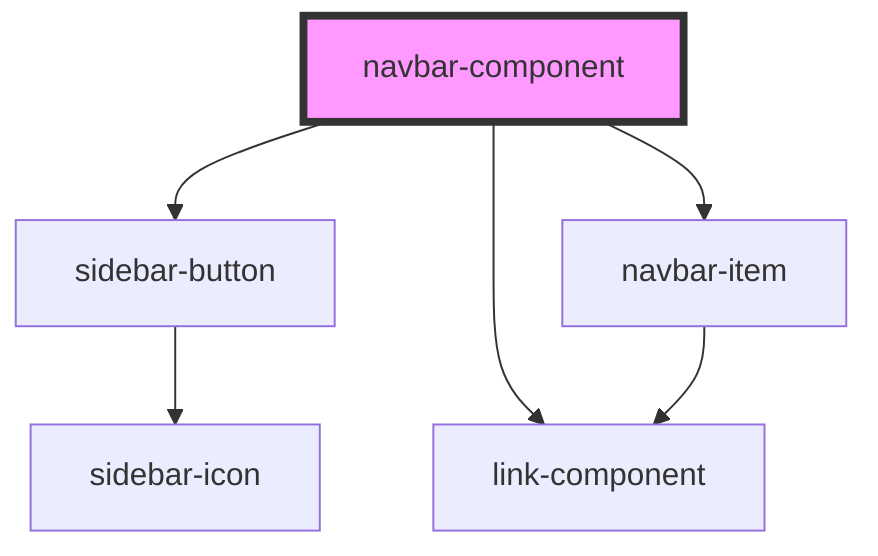

# navbar-component

<!-- Auto Generated Below -->

## Properties

| Property          | Attribute           | Description | Type                                | Default     |
| ----------------- | ------------------- | ----------- | ----------------------------------- | ----------- |
| `home`            | `home`              |             | `string`                            | `undefined` |
| `items`           | --                  |             | `{ name: string; goto: string; }[]` | `undefined` |
| `sidebarIconSize` | `sidebar-icon-size` |             | `string`                            | `"1"`       |
| `styles`          | --                  |             | `{ [key: string]: string; }`        | `undefined` |

## Dependencies

### Depends on

- [sidebar-button](../sidebar-button)
- [link-component](../link-component)
- [navbar-item](../navbar-item)

### Graph

----------------------------------------------

*Built with [StencilJS](https://stenciljs.com/)*
