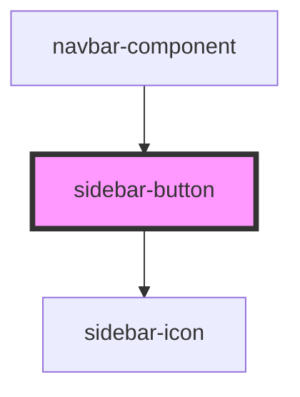

# sidebar-button

<!-- Auto Generated Below -->

## Properties

| Property   | Attribute   | Description | Type     | Default |
| ---------- | ----------- | ----------- | -------- | ------- |
| `iconSize` | `icon-size` |             | `string` | `"1"`   |

## Events

| Event         | Description | Type                   |
| ------------- | ----------- | ---------------------- |
| `isOpenEvent` |             | `CustomEvent<boolean>` |

## Dependencies

### Used by

 - [navbar-component](../navbar-component)

### Depends on

- [sidebar-icon](../sidebar-icon)

### Graph

----------------------------------------------

*Built with [StencilJS](https://stenciljs.com/)*
