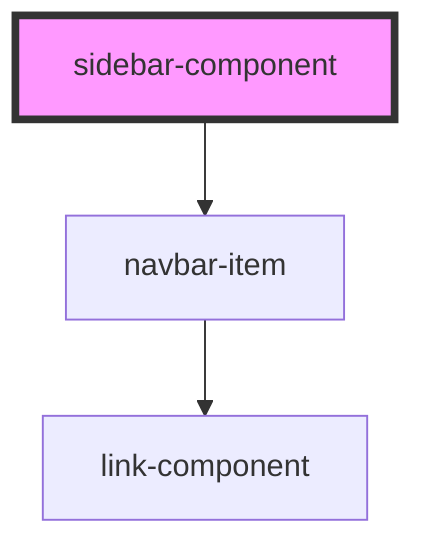

# sidebar-component

<!-- Auto Generated Below -->

## Properties

| Property | Attribute | Description | Type                                | Default     |
| -------- | --------- | ----------- | ----------------------------------- | ----------- |
| `items`  | --        |             | `{ name: string; goto: string; }[]` | `undefined` |
| `styles` | --        |             | `{ [key: string]: string; }`        | `undefined` |

## Dependencies

### Depends on

- [navbar-item](../navbar-item)

### Graph

----------------------------------------------

*Built with [StencilJS](https://stenciljs.com/)*
