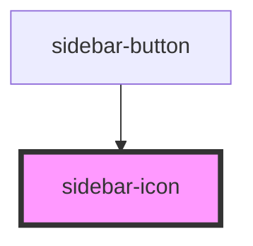

# sidebar-icon

<!-- Auto Generated Below -->

## Properties

| Property   | Attribute   | Description | Type     | Default |
| ---------- | ----------- | ----------- | -------- | ------- |
| `iconSize` | `icon-size` |             | `string` | `"1"`   |

## Dependencies

### Used by

 - [sidebar-button](../sidebar-button)

### Graph

----------------------------------------------

*Built with [StencilJS](https://stenciljs.com/)*
